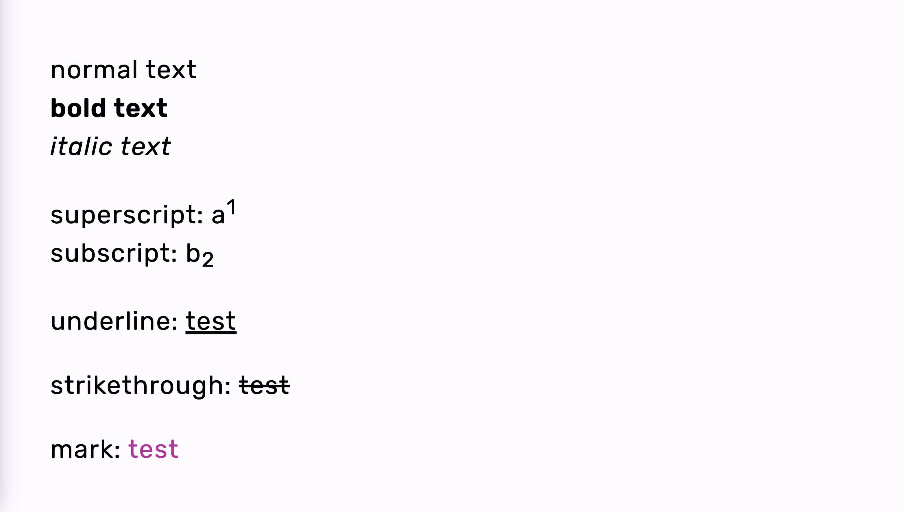

# Marp theme

This is a **minimal marp theme** as well as "boilerplate project" for marp presentations.
It contains the theme in `theme/` and a few basic markdown-it plugins (see `engine/engine.js`).

See the [marp website](https://marp.app/) for a ton more information, especially this [reference](https://marpit.marp.app/) for the available features and syntax is useful.

[pnpm](https://pnpm.io) was chosen as the package manager, but npm works as a drop-in replacement.

The primary work flow is cloning this repository and using it as a base for your own repo.

```sh
git clone <this repo>
git remote remove origin
git remote add origin <your repo>

pnpm install
pnpm dev   # for browser preview
pnpm build # for building slides (pdf)
```

## Overview

<p float="left">
  
  
  
  
  
  
  
  
</p>

Also check out the pdf generated from the `slides/test.md` file.
You can do so by downloading it from the releases tab of this repo.

## Structure

```sh
.
├── engine/
│   └── engine.js    # add markdown-it plugins in here
├── output/          # pdf output goes here
├── package.json
├── slides/          # put your slides in here
└── theme/           # all theme related things come in here
    ├── code.css     # code block related
    ├── colors.css   # css variables (default and .invert)
    ├── headings.css # all things headings
    └── minimal.css  # entry point and general styles
```

## Automation

Included in this repo is a github action for automatically building your slides and creating a release whenever you push a tag (starting with `v` for version).

To use this update the `OUTPUT_FILE_NAME` at the top of `.github/workflows/build.yml` to fit your filename.

## License

This project is licensed under MIT (see `LICENSE` file).
Just add yourself to the `LICENSE` file and thats it.
If you want to outright remove the license file you can do so but maybe drop a link somewhere to this repo (along with the info that it's MIT licensed), that would be neat :3

## Attribution

This repo uses the [Rosé Pine](https://rosepinetheme.com/) theme (base and dawn variants) for code blocks.
